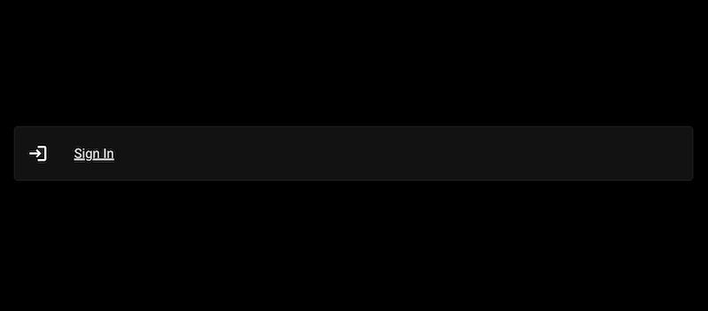

## Overview
This is a **demo app** that integrates [Next.js](https://nextjs.org/) 
and [MUI](https://mui.com/material-ui/getting-started/) to present a 
sign-in dialog, connected to a primitive backend.

Upon signing in with a valid email, and the password `seekrit`, it will
 issue a JWT and set it as a httpOnly cookie.

### Launch instructions
Simply clone the repo, run `pnpm i` and then `pnpm dev`.

### Preview

